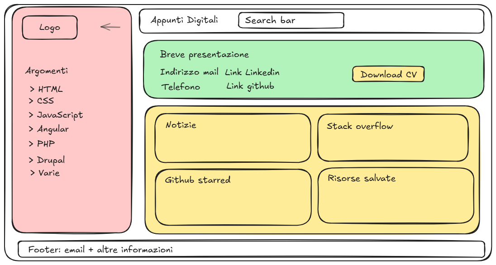
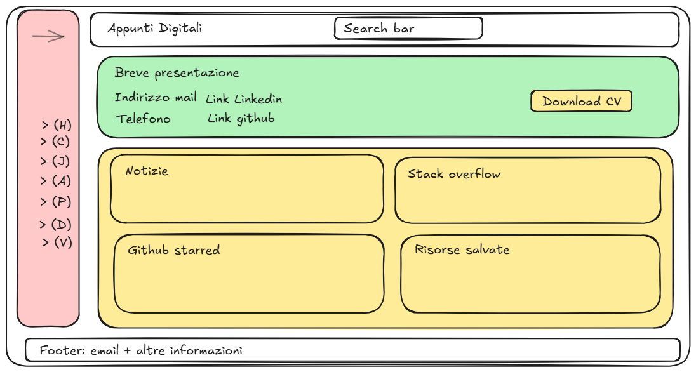
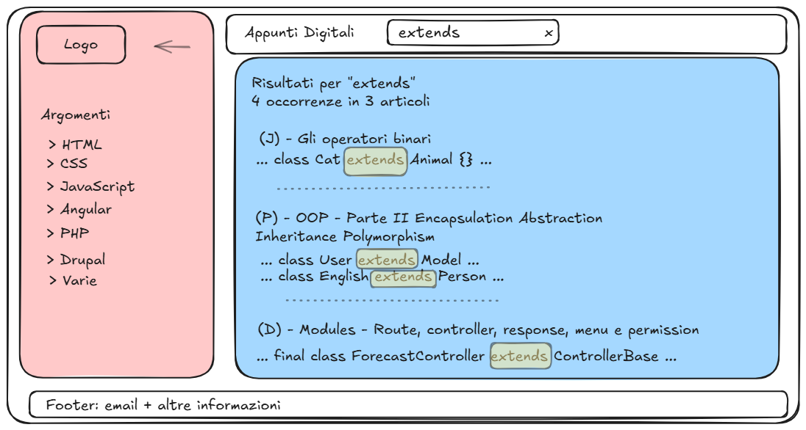
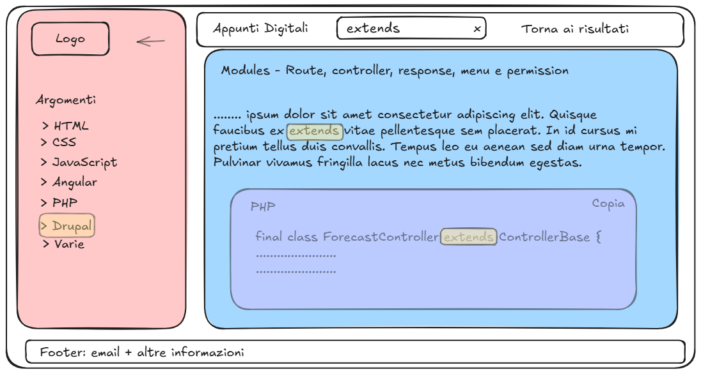
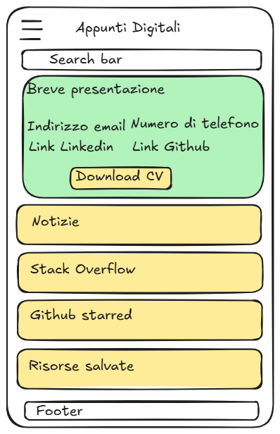
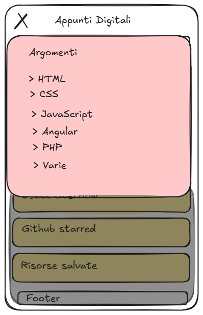
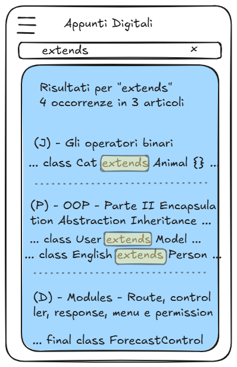
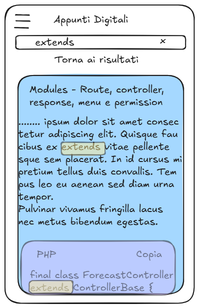

# Wireframe

I wireframe rappresentano la struttura low-fidelity dell'interfaccia definita nell'analisi UX/UI.

Non descrivono colori, tipografia o stile grafico definitivo, che sono definiti nel design system.

## Desktop

### Home — sidebar aperta

### Home — sidebar collassata

### Risultati di ricerca

I risultati sono mostrati in un overlay opaco e raggruppati per articolo.

### Articolo aperto da ricerca

La query rimane nella barra di ricerca, il termine cercato rimane evidenziato e l'utente può tornare ai risultati precedenti.

## Mobile

### Home

### Drawer di navigazione aperto

### Risultati di ricerca

### Articolo aperto da ricerca

